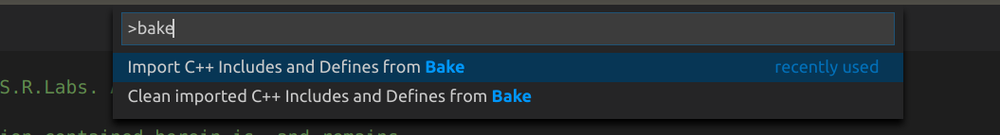
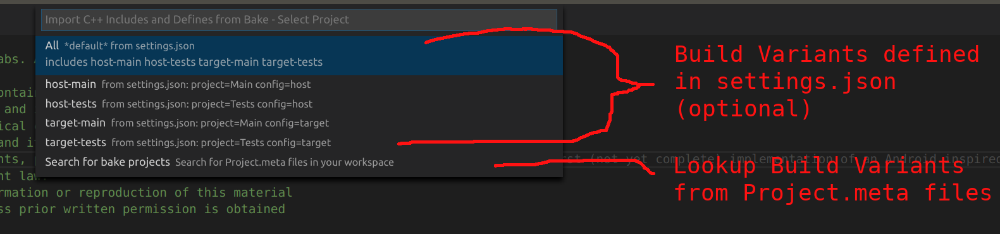

This extension adds support for bake based C++ projects to VS Code.

Bake is a build tool for C++ projects supporting:
- multiple modules (library, executable)
- multiple targets

## Features

- Import C/C++ Include paths and Defines into VS Code
- Create new .h and .cpp files based on templates (from explorer's context menu)
- Search for and execute targets from bake files (from Tasks: Run Task command)
- Show Hovers
- Show Code Completion Proposals
- Document Formatting (`bake-format` tool is used)
- Support Bake RText Service

The following features are provided by the Bake Language Server if `useRTextServer` is enabled:
- Provide Diagnostics

## Requirements

- bake installation >= 2.42.1 ([bake installation instructions](https://esrlabs.github.io/bake/install/install_bake.html#how-to-install-bake))
- Linux (Windows and Mac OS X might work too)
- an existing `.vscode/c_cpp_properties.json` file ([how to create](https://code.visualstudio.com/docs/languages/cpp#_intellisense))
- RText Server functionality requries bake-toolkit >= 2.56.0

## Usage

#### Manage C++ Includes and Defines

VS Code's C++ integration requires a list of include paths and
defines of your workspace. These need to be confiured at `.vscode/c_cpp_properties.json`. The bake extension can assist
you with keeping the `c_cpp_properties.json` inline with your
bake configuration.

From the command palette `Ctrl+Shift+P`:
- Import C++ Includes and Defines from Bake
- Clean imported C++ Includes and Defines from Bake



#### Import C++ Includes and Defines from Bake

A bake workspace typically contains multiple bake projects. Each project is
defined by a `Project.meta` file. Typically projects depend on other projects. To import the C++ Includes and Defines, you need to select
a project and build-config to build the dependency tree from.

There are two ways on how to select a project/config combination.

1) Optional: there are pre-defined combinations at your `.vscode/settings.json`. These
combinations are called *build variants*. They may include an optional `--adapt`
parameter, too. If a build variant is marked as `default=true` is is automatically imported during opening of the workspace.

2) Let VS Code search for `Project.meta` files in your workspace. Then you can select the project and the build-config afterwards.




#### Task definition

If `config` property is not set, then the Bake project default configuration will be used. The `name` property is used only in the VS Code UI to identify your task in the Tasks list.

```json
{
    "name": "MyTask",
    "type": "bake",
    "project": "project_name",
    "config": "config_name",
    "problemMatcher": [
        "$gcc"
    ],
    "group": "build",
    "args": "argument_list"
}
```

#### Create new .h/.cpp files

The bake extension can assist you in creating new `.h` or `*.cpp` files. The files are then pre-filled with copyright informations, namespace definitions (derived from the folder name) and an empty class definition.

To create a new file: Select a folder at the Explorer panel and open the context menu (right mouse click).

You can customize the templates used to fill the files here:
- `.vscode/template.h`
- `.vscode/template.cpp`


## Extension Settings

This extension contributes the following settings:
* `bake.parallelBuildNum`: Number of processes used for parallel bake builds (-j parameter). Global setting that defaults to `8`.
* `bake.unitTestsAdapt`: Adapt for setting used compiler in unit test builds. Global setting that defaults to  `gcc`.
* `bake.runUnitTestsOnBuild`: Boolean whether unit tests shall be run after a successfull unit test build. Global setting that defaults to `true`.
* `bake.defaultPromblemMatcher`: Used problem finder in the output during builds. Default to `$gcc`. Can be overwritten per task in task configuration.
* `bake.buildVariants`: optional setting to define build variants to retrieve includes/defines from. A buildVariant is defined by a project (bake's -m flag) and a build config. Here is an example configuration for embedded development:

```
    "bake.buildVariants": {
        "All": {
            "importFrom": [
                "host-main",
                "host-tests",
                "target-main",
                "target-tests"
            ],
            "default": "true"
        },
        "host-main": {
            "project": "Main",
            "config": "host",
            "adapt": "clang"
        },
        "host-tests": {
            "project": "Tests",
            "config": "host",
            "adapt": "clang"
        },
        "target-main": {
            "project": "Main",
            "config": "target"
        },
        "target-tests": {
            "project": "Tests",
            "config": "target",
        }
```
* `bake.useRTextServer` : Enable Bake RText service. Requires bake-toolkit version 2.56.0 or greater.

Deprecated (the following settings are now ignored):
* `bake.mainProject`: override the path to the main project (bake's -m flag). Default is `Main`
* `bake.targetConfig`: override the name of the target config

## Known Issues

None

## Debugging

If anything behaves unexpected check the `Bake` and `Bake Language Server` tab in the output window.

## Authors

- Florian Bramer
- Troels Frimor
